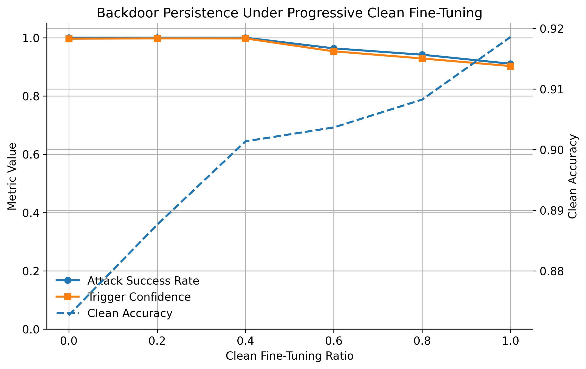

# Beyond Binary Evaluation of Backdoor Inheritance

### Measuring Inherited Model Failures Under Progressive Fine-Tuning

> A research framework for evaluating inherited model failures as **continuous degradation processes** rather than binary survival outcomes.

---

## Overview

Backdoor inheritance is typically evaluated using a single binary question:

> **Does the backdoor survive after fine-tuning?**

While useful, this perspective discards information about *how* inherited failures evolve under progressively stronger interventions.

This project proposes an alternative evaluation methodology.

Instead of treating inherited failures as binary events, it measures them as **continuous degradation processes** by tracking multiple security and utility metrics throughout progressive clean fine-tuning.

Although the initial implementation focuses on **BadNet backdoor inheritance** in NLP models, the framework is intentionally designed to support future research on other inherited model failures and intervention strategies.

Every experiment is configuration-driven and reproducible through fixed random seeds, timestamped outputs, and saved checkpoints.

---

# Research Question

> **Can inherited model failures be evaluated more effectively as continuous degradation processes rather than binary survival outcomes?**

---

# Key Idea

Rather than evaluating only the beginning and end of an intervention, the framework measures model behavior throughout progressively stronger interventions.

```
Backdoored Model
        │
        ▼
Progressive Clean Fine-Tuning
0% → 20% → 40% → 60% → 80% → 100%
        │
        ▼
Evaluate After Every Intervention
        │
        ▼
Continuous Degradation Curves
```

This provides substantially richer insight than a single before/after comparison.

---

# Features

- Configuration-driven experiments
- Modular attack and intervention pipeline
- Progressive clean fine-tuning
- Continuous evaluation metrics
- Automatic checkpointing
- Timestamped experiment outputs
- Publication-quality visualizations
- Reproducible experimental pipeline

---

# Methodology

The baseline experiment consists of:

| Component | Implementation |
|-----------|----------------|
| Dataset | SST-2 |
| Model | DistilBERT |
| Attack | BadNet |
| Trigger | `cf` |
| Poison Rate | 15% |
| Intervention | Progressive Clean Fine-Tuning |

Models are evaluated after every intervention stage.

---

# Evaluation Metrics

The framework measures multiple complementary properties.

| Metric | Purpose |
|---------|----------|
| **Attack Success Rate (ASR)** | Measures persistence of the inherited backdoor |
| **Clean Accuracy** | Measures preservation of downstream task performance |
| **Mean Trigger Confidence** | Measures confidence assigned to the attacker target class |
| **Retention Ratio** | Normalized measure of inherited attack capability remaining |

Rather than relying on a single metric, these measurements collectively characterize how inherited failures evolve under intervention.

---

# Architecture

The repository is organized around **scientific variables** rather than software implementation details.

```
Dataset
    │
    ▼
Attack
    │
    ▼
Model
    │
    ▼
Intervention
    │
    ▼
Evaluation
    │
    ▼
Visualization
```

Each module represents an independent research dimension, allowing attacks, interventions, models, and evaluation methodologies to evolve independently.

---

# Repository Structure

```text
backdoor-inheritance/
│
├── configs/
│   └── baseline.yaml
│
├── experiments/
│   └── baseline.py
│
├── src/
│   ├── attacks.py
│   ├── data.py
│   ├── evaluation.py
│   ├── interventions.py
│   ├── models.py
│   ├── train.py
│   ├── utils.py
│   └── visualization.py
│
├── results/
│   └── baseline_<timestamp>/
│       ├── metrics.csv
│       ├── figures/
│       └── checkpoints/
│
├── requirements.txt
└── README.md
```

---

# Results

The baseline implementation demonstrates that inherited backdoor behavior degrades progressively rather than disappearing immediately under clean fine-tuning.

<p align="center">
  
</p>

Key observations:

- Attack Success Rate decreases progressively as intervention strength increases.
- Mean trigger confidence declines alongside Attack Success Rate.
- Clean accuracy remains comparatively stable throughout fine-tuning.
- Continuous evaluation reveals degradation patterns that would be hidden by binary before/after evaluation.

---

# Reproducing the Baseline Experiment

## 1. Clone the repository

```bash
git clone <repository-url>
cd backdoor-inheritance
```

---

## 2. Create a virtual environment

```bash
python -m venv .venv
```

Windows

```bash
.venv\Scripts\activate
```

Linux/macOS

```bash
source .venv/bin/activate
```

---

## 3. Install dependencies

```bash
pip install -r requirements.txt
```

---

## 4. Run the experiment

```bash
python main.py
```

---

# Outputs

Each experiment creates a timestamped directory.

Example:

```text
results/
└── baseline_20260719_155148/
    ├── metrics.csv
    ├── figures/
    │   ├── persistence_curve.png
    └── checkpoints/
```

---

# Scientific Contribution

This project **does not introduce**

- ❌ A new backdoor attack
- ❌ A new defense mechanism
- ❌ A new optimization algorithm

Instead, it contributes

- ✅ A methodology for evaluating inherited model failures as continuous degradation processes
- ✅ A reproducible evaluation framework for comparing intervention strategies
- ✅ A modular research pipeline that supports future extensions

---

# Reproducibility

Every experiment records:

- Configuration
- Random seed
- Model checkpoints
- Evaluation metrics
- Generated figures
- Timestamped output directory

A single configuration file is sufficient to reproduce the reported experiments.

---

# Roadmap

The architecture is intentionally modular and can be extended to investigate:

- Multiple transformer backbones
- Additional NLP datasets
- Multiple backdoor attack families
- Parameter-efficient fine-tuning (LoRA)
- Pruning-based interventions
- Teacher–student inheritance
- Representation similarity analysis
- Calibration metrics
- Additional evaluation methodologies

---

# Tech Stack

- Python
- PyTorch
- Hugging Face Transformers
- Hugging Face Datasets
- NumPy
- Pandas
- Matplotlib


